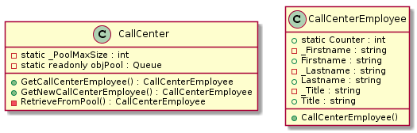

= Online Shopping Center 
== Design Patterns
=== Gurkan Gokdemir 140202038 (github.com/gurkangokdemir)

*Project Uml*

image::DIAGRAMS/use-case-v2.png[image]
* Use case diagram contains all project details.

[NOTE]
====
This project created in VS CODE environment with dotnet core 2.1
====

----
dotnet run
----

[NOTE]
====
Program.cs uses PatternStrategy(Strategy Pattern)
====

* It was an easy solution.
* I also wanted to use strategy pattern too.
* So I decided to use it.

----
Project goal is to create an interactive Online Shopping System.
----

*Class Diagram*

image::DIAGRAMS/class.png[image]

* This is the diagram of the project.
* All necessary classes are exist.
* It's a basic Online Shopping System.

*1. Singleton Pattern*

image::1.Singleton/image.png[image]

* I use this pattern to have only one admin on the system.
* It checks if there is an admin exist. If not. Creates one.

*2. Factory Pattern*

image::2.Factory/image.png[image]

* Site has two versions. One in web and one in mobile.
* These platforms have same responsiblity. So i used factory pattern to easily configure it.

*3. Prototype Pattern*

* In this scenario user wants to create new account with same credit card. 
* If card is deep copied, user can change every details on new card.
* If not, IdInfo and CardInfo classes content is not going to change.

*4. Object Pool Pattern*

* Our clients could have problems about their purchase. So we have a call center system.
* But as like all companies. We have limitted employee for clients.
* If an employee is free. We dont need to hire another.
* Object pool pattern organizes and solves this problem.

*5. Builder Pattern*

image::5.Builder/image.png[image]

* There is a two kind a membership program on our platform. 
* MinimalMembership and FullFeatured membership. 
* With Minimal membership customer can have 10 percent discount on every second product.
* In other case, with FullFeatured membership customer can get %10 discount on second, %20 discount on third
%50 discount on fourth product.
* Builder contains different steps for different needs. Director control that steps. So we can easily add new membership plan.

*6. Abstract Factory Pattern*

image::6.AbstractFactory/image.png[image]

* We have tech store on our shopping site, there are high performance computers.
* Customer can choose their computer as desktop or notebook.
* Also we have two type of computers one is Gaming other is Workstation.
* Without abstract factory pattern there could be multiple classes. And if we wanted to change some configuration.
It could be hard for us to add and remove without abstract factory.

*7. Iterator Pattern*

image::7.Iterator/image.png[image]

* Our lucky customers can get some coupons.
* This pattern used for to give customers their gifts.

*8. Observer Pattern*

image::8.Observer/image.png[image]

* We sometimes have some discounts for some special products.
* And clients wants to get notified about specific discounts rates.
* Observer pattern is the best solution for this problem.
* Every customer have a discount treshold.
* If a discount reached that treshold. Customer get notified.
* We can easily add and remove customer from the observer list.

*9. Memento Pattern*

image::9.Memento/image.png[image]

* There is a shopping card for extra discounts and free products.
* Users sometimes wants to change their cards. But new cards doesnt contains information about old purchases.
* When customer wants old details and configurations. We use this pattern.
* Customer can quickly restore their old card.

*10. Command Pattern*

* There are steps to have a successful purchase.
* This pattern used for secure purchases.
* It takes payment amount, user info and card info. Then check them.
* If information is consistent. Process ends with purchase.

*11. Adapter Pattern*

image::11.Adapter/image.png[image]

* Our customers have accounts on the other shopping sites. We provide them to easy integration between sites with adapter.

